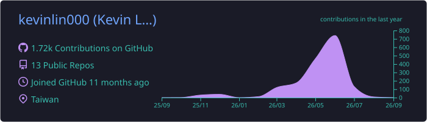
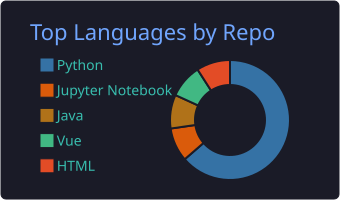
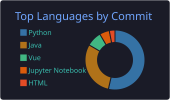
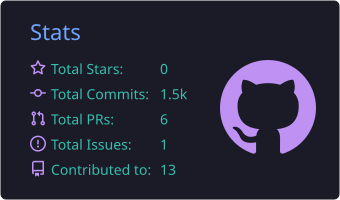
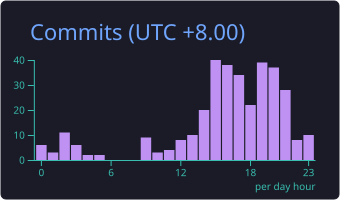

 

## 🧑‍💻 About Me

**Backend Engineer｜Java / Spring Boot・AI Application Development・Data Engineering**

- 獨立完成 2 個部署上線的交易系統：狀態機、金流冪等、Redisson 分散式鎖與併發控制
- AI 應用開發：Agent 工具串接、RAG（關鍵字＋語意混合檢索）、SSE 串流，以版本化評測集在 CI 中做回歸防護
- 資料工程：Airflow 排程自動化、ETL Pipeline，處理 **400 萬筆以上**時序資料
- 金融與法律背景轉職工程 — 邏輯嚴謹、重視業務效率；CS 基礎課程兩學期平均 **94 分**
- 現正尋找後端 / AI 應用工程師機會

<picture>
  <source media="(prefers-color-scheme: dark)" srcset="https://raw.githubusercontent.com/kevinlin000/kevinlin000/output/github-snake-dark.svg" />
  <source media="(prefers-color-scheme: light)" srcset="https://raw.githubusercontent.com/kevinlin000/kevinlin000/output/github-snake.svg" />
  
</picture>

 

## 📈 GitHub Stats

 

## 🎬 Live Demos

| 專案 | Demo | 說明 |
|---|---|---|
| 🍽️ **ByteBites** | [bytebites-kevin.duckdns.org](https://bytebites-kevin.duckdns.org) | AI Agent 餐廳訂位營運平台（Web + LINE） |
| 🥬 **菜籃日** | [用戶端](https://d3hqnux25iirgl.cloudfront.net)｜[管理端](https://d3czahyk4cnvb9.cloudfront.net) | 揪團生鮮電商平台（高併發搶團） |
| 🏭 **FactoryOps** | [factoryops-tau.vercel.app](https://factoryops-tau.vercel.app) | 設備維修管理系統 CMMS + 企業內部 RAG |
| 🚲 **YouBike 2.0** | [Streamlit App](https://youbike-etl-pipeline-8dyh8p6fb3m5kxkpwlhezb.streamlit.app/)｜[Tableau](https://public.tableau.com/app/profile/.40927878/viz/YouBike_17669139069900/1) | 站點風險預測與調度工作台 |
| 🌅 **敘日** | [前端展示](https://restaurant-xuri-frontend.vercel.app) | 餐廳管理系統（5 人團隊，任組長） |

 

## 🛠️ Tech Stack

### Backend

-6DB33F?style=flat-square&logo=springsecurity&logoColor=white)

第三方整合：LINE（Login / Messaging）・綠界 ECPay / TapPay・Google OAuth / Maps

### Databases & Middleware

### AI & Data Engineering

開發流程：Harness Engineering・Spec-Driven Development・CLAUDE.md / AGENTS.md（Claude Code, Codex）

### Frontend

Vue 3 完整專案實作（用戶端＋管理後台）・Pinia・Element Plus・HTTP / REST / CORS / JWT

### Infrastructure & Deployment

AWS（EC2 / S3 / CloudFront）・GCP・Nginx 反向代理・GitHub Actions CI/CD・Docker Compose

 

## 🚀 Featured Projects

### 🍽️ ByteBites｜AI Agent 餐廳訂位營運平台
**個人開發** | `Java 17` `Spring Boot` `FastAPI` `Gemini Function Calling` `Qdrant` `MySQL` `Redis` `RabbitMQ` `AWS`
[Repo](https://github.com/kevinlin000/ai-enhanced-local-services) ｜ [Demo](https://bytebites-kevin.duckdns.org)

> 自然語言需求 → 餐廳推薦 → 訂位草稿 → 使用者確認 → 訂金付款。AI 只負責理解與建立草稿，正式訂位、金額與付款狀態由 Java 後端狀態機控管，高風險操作必經使用者確認。

- 建立 15 個版本化核心案例評測集（Hit@5），檢索調整後由 10/15 → **15/15**；每次修改檢索策略必重跑評測，防止回歸
- 限時餐券搶購：Redis Lua 預扣庫存 + RabbitMQ 非同步寫單，降低超賣與重複下單風險
- Guardrails：prompt injection 防護、敏感內容過濾、單次對話限一筆訂位
- LLMOps：每次 LLM 呼叫的 token 用量、延遲、結果送 Prometheus / Grafana 追蹤成本與服務狀態
- 已付款改單流程：「原單保留、差額付款、店家確認、正式生效」，確保金額、座位與內容一致

### 🥬 菜籃日｜揪團生鮮電商平台
**個人獨立開發** | `Java 17` `Spring Boot` `MyBatis` `MySQL` `Redis (Redisson)` `Vue 3` `ECPay` `AWS CloudFront`
[Repo](https://github.com/kevinlin000/local-fresh-platform) ｜ [用戶端 Demo](https://d3hqnux25iirgl.cloudfront.net) ｜ [管理端 Demo](https://d3czahyk4cnvb9.cloudfront.net)

> 核心問題：揪團高併發 — 多人同時加團不能超過成團人數、同一會員不能重複加入。

- 三層保護：Redisson 分散式鎖 + 交易邊界 + 資料庫唯一鍵；JMeter 模擬 100 併發加團後回查 DB，驗證無超賣、無重複加入
- 兩層訂單模型：「揪團活動」與「參與者預訂單」分離，成團/失敗只需批次轉換狀態，不需重建訂單
- 金流冪等：`payment_event` 事件表記錄付款請求 / 成功 / 重複 / 拒絕 callback，避免重送通知重複入帳
- Testcontainers 啟動 Redis 驗證併發鎖行為；Prometheus / Grafana 監控 callback 與對帳指標

### 🏭 FactoryOps｜設備維修管理系統 CMMS + 企業內部 RAG
**個人獨立開發** | `C#` `.NET` `ASP.NET Core` `EF Core` `Dapper` `SQL Server 2025` `Vue 3` `Docker Compose`
[Repo](https://github.com/kevinlin000/FactoryOps) ｜ [Demo](https://factoryops-tau.vercel.app/)

> 設備報修 → 維修工單 → 主管審批 → 結案與稽核追蹤。核心為應用層工單狀態機：轉換規則可測試、可版控，非法轉換在 API 層明確拒絕。

- 稽核紀錄 append-only：保留操作者、來源/目標狀態與時間；共 **46 個測試**（含 SQL Server 整合測試與 HTTP 層 API 測試）
- 新舊系統並存：新資料走 EF Core，既有 MES 介接走 Dapper + 預存/觸發程序，建立架構邊界
- SOP 知識庫 RAG：SQL Server 2025 原生 VECTOR_DISTANCE 精確 Top-K 檢索，超出範圍即拒答並附來源
- AI 權限邊界：RAG 服務僅依賴唯讀介面，以測試固定此約束；檢索命中率 / 引用正確率 / 拒答正確率納入 CI 離線評測（固定輸出測試替身）；以 ADR 記錄暫不上 ANN 索引的取捨

### 🚲 YouBike 2.0｜站點風險預測與調度工作台
**個人專案・ccclub 2025 秋季班特優作品** | `Python` `Airflow` `MySQL` `FastAPI` `Streamlit` `PyTorch (LSTM)` `Docker` `GCP`
[Repo](https://github.com/kevinlin000/YouBike-ETL-Pipeline) ｜ [Demo](https://youbike-etl-pipeline-8dyh8p6fb3m5kxkpwlhezb.streamlit.app/) ｜ [Tableau](https://public.tableau.com/app/profile/.40927878/viz/YouBike_17669139069900/1)

- Airflow 每 10 分鐘擷取站點狀態寫入 MySQL，累積 **400 萬筆以上**；靜態/高頻資料分離、唯一鍵防重複
- 變異係數、t 檢定、ANOVA、卡方檢定定位尖峰缺車與滿站風險，轉為調度優先順序
- Multi-Station LSTM 原型：模型權重、scaler、站點 mapping、metadata 封裝為可追蹤模型資產；FastAPI 提供推論 / readiness / metrics / request tracing / 多站風險排序 API
- 保留 baseline 比較與模型限制說明 — LSTM 尚未穩定優於最強 baseline，定位為模型服務化原型而非高準確度模型

### 🌅 敘日｜餐廳管理系統（5 人團隊・組長）
**團隊開發（5 人）・擔任組長** | `Spring Boot` `Spring Security` `Vue 3` `MySQL`
[Repo](https://github.com/kevinlin000/restaurant-admin-backend) ｜ [前端 Demo](https://restaurant-xuri-frontend.vercel.app)

- 擔任 develop 分支整合者：依模組相依性分批合併 **9 條 feature 分支**，合併後跑後端測試 + 前端 build，維持主分支可運行
- RBAC：ADMIN 管全門市、MANAGER 僅管所屬門市，權限檢查放後端，防 URL / 參數越權
- FAQ 模組設計為可分析知識庫：記錄熱門與未命中問題，供營運補強內容

### 🥗 餵食碳排小幫手｜LLM 輔助資料清洗管線
**團隊開發（5 人）・負責資料清洗模組＋獨立優化 LLM 流程** | `Python` `Scrapy` `Kafka` `Airflow` `MySQL` `Gemini API` `GCP`
[Repo](https://github.com/kevinlin000/carbon-footprint-helper)

- 成本階梯：本地規則 → 標準單位轉換 → cache → 才呼叫 LLM，控制成本與錯誤率
- LLM 輸出以 Pydantic schema 驗證，格式錯誤 / 異常值寫入前拒絕，避免污染 DB 與快取
- 建立 **56 筆人工標註離線評測集**：不需呼叫線上 LLM 即可重現測試，量化欄位覆蓋率、準確率與平均誤差

### 🧪 生成式 AI 評估｜文字・圖像・影片多模態案例研究
[Repo](https://github.com/kevinlin000/generative-ai-evaluation)

- 一致方法：固定輸入、控制變因、保留原始輸出，再以評分 / 案例分類 / 失敗分析比較模型
- 文字：5 個 LLM × 3 歷史時點投資建議，6 維度人工 + LLM-as-judge 雙軌評分（75 段逐字稿）；圖像：18 組暗示型提示比較 GPT vs Gemini；影片：工具停服中途改用 Google Flow / Veo，驗證分階段設計可換模型不重做

 

## 📫 Connect

